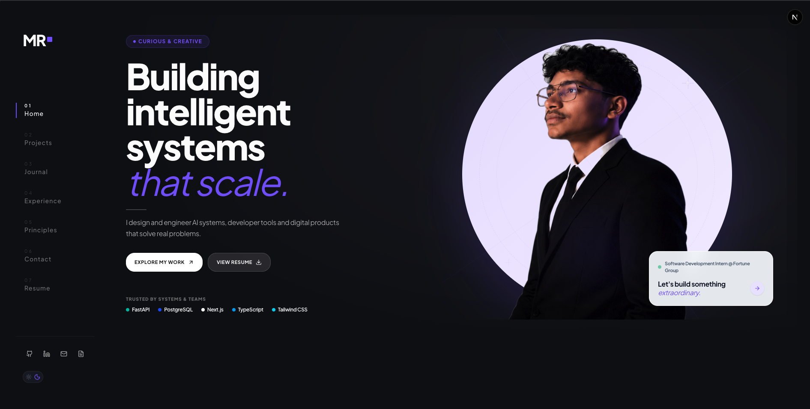

# Mohammad Razim — Portfolio

> An editorial portfolio built to showcase engineering, design, writing, and the journey of building software.

Inspired by the clarity of Apple, the craftsmanship of Linear, the storytelling of Stripe, and the elegance of Framer.

---

# Philosophy

This portfolio is intentionally designed as a **content-first editorial experience** rather than a traditional developer portfolio.

Every page is built around a simple principle:

> **Content should be the hero, interfaces should disappear.**

The architecture separates application logic from content, allowing the portfolio to grow without repeatedly modifying UI components.

---

# Features

- Editorial-inspired interface
- Responsive layout
- Content-driven architecture
- Modular component system
- Design token based styling
- Dynamic Journal system
- Interactive Resume
- Experience timeline
- Project case studies
- SEO friendly
- Accessible by default

---

# Technology Stack

## Framework

- Next.js (App Router)
- React
- TypeScript

## Styling

- Tailwind CSS v4
- CSS Variables
- Design Tokens

## UI

- shadcn/ui
- Radix UI
- Lucide React

## Content

- MDX
- Frontmatter
- Content-driven rendering

---

# Design Language

The visual identity follows a restrained editorial aesthetic.

### Principles

- Spacious layouts
- Typography-first hierarchy
- Soft material surfaces
- Warm ivory backgrounds
- Ambient lavender lighting
- Minimal visual noise
- Purposeful motion
- Strong negative space

Rather than creating interface-heavy experiences, every page is designed to let the content lead.

---

# Project Structure

```
.
├── app/
├── content/
│   └── journal/
│       ├── _TEMPLATE.mdx
│       ├── linkedin/
│       └── medium/
│
├── public/
│
├── src/
│   ├── components/
│   ├── data/
│   ├── hooks/
│   ├── lib/
│   ├── styles/
│   ├── types/
│   └── utils/
│
├── docs/
└── README.md
```

---

# Routing

## Public Pages

| Route         | Description              |
| ------------- | ------------------------ |
| `/`           | Landing page             |
| `/experience` | Professional experience  |
| `/resume`     | Interactive resume       |
| `/journal`    | Writing and publications |

---

# Homepage Structure

The landing page follows an editorial narrative rather than a dashboard layout.

```
Hero

↓

Featured Projects

↓

Experience Preview

↓

Journal Preview

↓

Principles

↓

Contact
```

Every section intentionally introduces a different aspect of the portfolio while maintaining a consistent visual rhythm.

---

# Navigation

The navigation uses two patterns.

## Homepage

Section navigation

```
/
/#projects
/#experience
/#journal
/#contact
```

## Standalone Pages

```
/resume

/experience

/journal
```

This keeps the homepage lightweight while allowing deeper exploration through dedicated pages.

---

# Content Architecture

The portfolio follows a content-driven architecture.

Application code and content remain completely separate.

```
content/

journal/

linkedin/

medium/
```

Adding a new article should never require editing React components.

Create a new `.mdx` file inside the appropriate directory and the application automatically discovers and renders the content.

---

# Journal

The Journal is designed as a lightweight publishing system.

Supported platforms:

- LinkedIn
- Medium

Future support can include:

- Hashnode
- Dev.to
- Personal articles

Each entry is represented as a standalone MDX document with frontmatter metadata.

---

# Design System

The entire UI is built from reusable design tokens.

This includes:

- Typography scale
- Spacing system
- Colour palette
- Elevation
- Motion
- Radius
- Shadows
- Editorial grid
- Ambient lighting

Components consume tokens instead of hardcoded values.

---

# Component Architecture

Components are organised by feature rather than page.

```
components/

layout/

navigation/

hero/

projects/

experience/

journal/

shared/
```

Each component is:

- reusable
- composable
- typed
- presentation-focused

---

# Development

Install dependencies

```bash
pnpm install
```

Run the development server

```bash
pnpm dev
```

Open

```
http://localhost:3000
```

---

# Scripts

```bash
pnpm dev

pnpm build

pnpm lint

pnpm start
```

---

# Roadmap

Planned improvements include:

- Search
- RSS Feed
- Reading mode
- Writing analytics
- Talks
- Awards
- Reading list
- Certifications
- Enhanced SEO
- Performance optimisation

---

# Inspiration

The portfolio draws inspiration from the product thinking and visual language of:

- Apple
- Stripe
- Linear
- Framer
- Vercel

Rather than replicating these products, the goal is to apply the same principles of clarity, restraint, hierarchy, and craftsmanship to a personal portfolio.

---

# License

This project is released under the MIT License.
