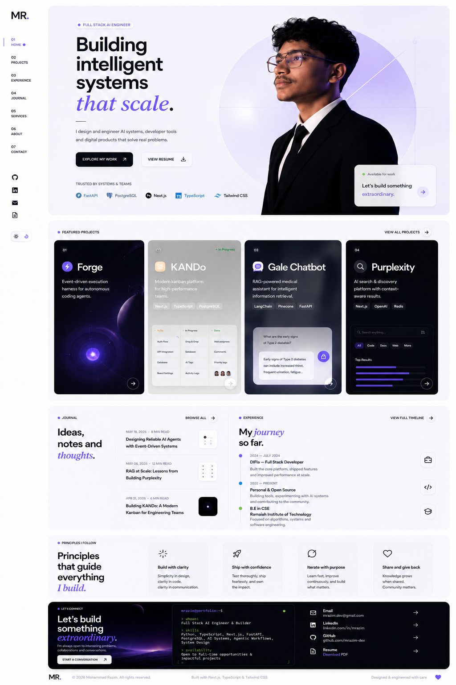

This portfolio must match the approved reference composition. Layout, spacing, typography hierarchy, negative space, proportions, and editorial rhythm should be preserved. Any design changes should improve implementation quality without deviating from the approved visual language.
